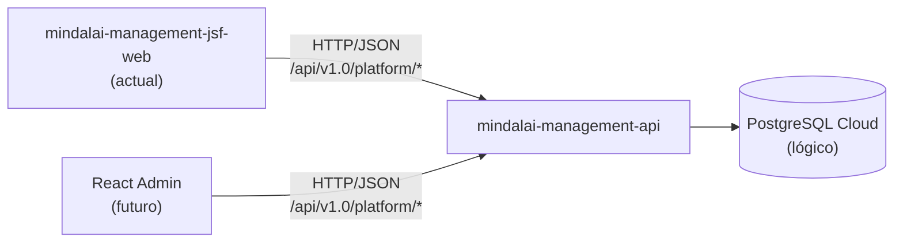
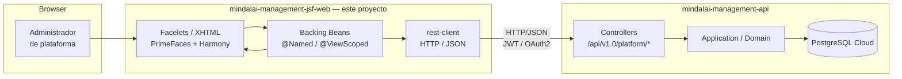
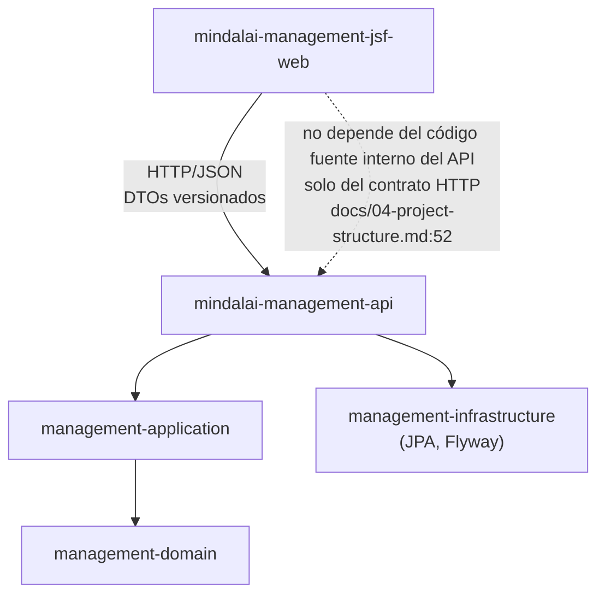
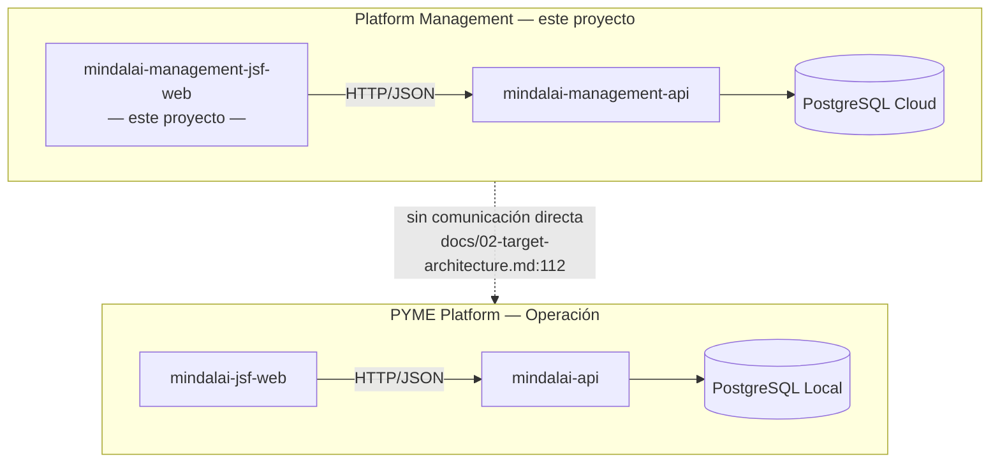
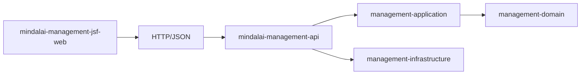
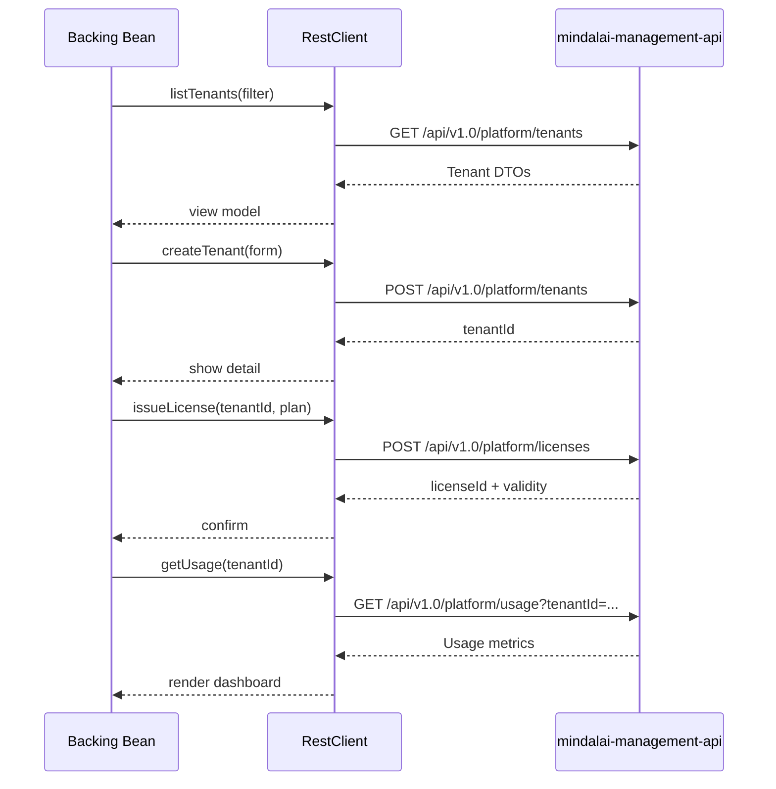
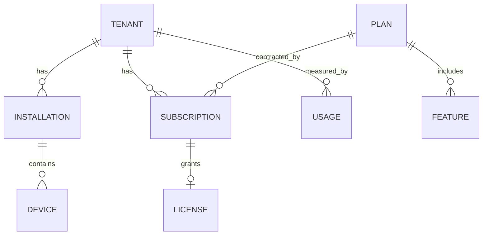

# mindalai-management-jsf-web — Platform Management JSF Web

     

> **Idioma:** Español en la narrativa; bloques de código y términos técnicos en inglés.

## Índice

1. [Propósito](#1-propósito)
2. [Contexto en la plataforma](#2-contexto-en-la-plataforma)
3. [Responsabilidades](#3-responsabilidades)
4. [Límites explícitos — lo que no hace](#4-límites-explícitos--lo-que-no-hace)
5. [Stack tecnológico](#5-stack-tecnológico)
6. [Arquitectura](#6-arquitectura)
7. [Estructura del proyecto](#7-estructura-del-proyecto)
8. [Integración REST](#8-integración-rest)
9. [Navegación y experiencia de backoffice](#9-navegación-y-experiencia-de-backoffice)
10. [Modelo de datos — visión UI](#10-modelo-de-datos--visión-ui)
11. [Seguridad](#11-seguridad)
12. [Configuración](#12-configuración)
13. [Desarrollo local](#13-desarrollo-local)
14. [Calidad, testing y Definition of Done](#14-calidad-testing-y-definition-of-done)
15. [Despliegue y operación](#15-despliegue-y-operación)
16. [Roadmap](#16-roadmap)
17. [Reglas de implementación aplicables](#17-reglas-de-implementación-aplicables)
18. [Criterios de aceptación](#18-criterios-de-aceptación)
19. [Referencias](#19-referencias)

---

## 1. Propósito

`mindalai-management-jsf-web` es la **aplicación web de backoffice administrativo** de la plataforma. Corresponde a `platform-management-web` definido en `shared-libraries/mindalai-platform-phase0/docs/02-target-architecture.md:99` y `shared-libraries/mindalai-platform-phase0/docs/04-project-structure.md:26`.

Es un frontend JSF independiente que consume exclusivamente `mindalai-management-api` vía HTTP/JSON. Es el punto de interacción de administradores de plataforma para gestionar tenants, planes, licencias e instalaciones.

> **Regla arquitectónica:** REST y JSF son deployables separados (`shared-libraries/mindalai-platform-phase0/docs/02-target-architecture.md:4`, `ADR-001`, `ADR-002`). Este proyecto no contiene lógica de dominio ni acceso a PostgreSQL.

## 2. Contexto en la plataforma

`mindalai-management-jsf-web` junto a `mindalai-management-api` forma el plano de gestión comercial de PYME Platform. Mientras `mindalai-api` y `mindalai-jsf-web` operan la tienda (minimarket), este par opera la plataforma como producto (`docs/10-platform-management.md:1`).

En el despliegue local, el backoffice puede correr en el mismo servidor Ubuntu que el API de gestión, en puerto distinto, sin base de datos propia. En SaaS, se convierte en la consola cloud para provisioning, billing y soporte (`docs/15-roadmap.md:94`).

La arquitectura permite reemplazar este JSF Web por React sin modificar `mindalai-management-api` (`docs/02-target-architecture.md:139`):



## 3. Responsabilidades

Según `docs/02-target-architecture.md:99` y `docs/10-platform-management.md:55`:

| Sección | Capacidades que implementa este proyecto |
|---|---|
| **Dashboard** | Métricas de plataforma, tenants activos, consumo, salud y alertas |
| **Tenants** | Listado, detalle, creación, edición, cambio de estado y búsqueda |
| **Plans** | Gestión de planes, límites y características |
| **Subscriptions** | Relación tenant-plan, vigencia, estado y renovación |
| **Licenses** | Emisión, renovación, revocación y expiración |
| **Installations** | Registro de instalaciones (ej. Minimarket XYZ → Installation #01 → Server + Caja 1/2/3, `docs/10-platform-management.md:22`) |
| **Devices** | Equipos autorizados por instalación |
| **Usage** | Visualización de consumo (comprobantes, usuarios, cajas, establecimientos) |
| **Support** | Tickets e incidentes |
| **Configuration** | Parámetros globales de plataforma |
| **Audit** | Trazabilidad administrativa |

Cada sección se implementa como backing beans + `RestClient` + Facelets, sin lógica de dominio propia.

## 4. Límites explícitos — lo que no hace

- No gestiona POS, inventario, ventas ni facturación.
- No interactúa con Authorization Service ni con SRI.
- No incluye `EntityManager`, `Repository` JPA, `DataSource` ni conexión PostgreSQL (`docs/04-project-structure.md:82`).
- No expone API REST propia; es consumidor puro.
- No comparte sesión ni permisos con `mindalai-jsf-web`; son contextos de seguridad distintos (`docs/10-platform-management.md:73`).

## 5. Stack tecnológico

Definido en `docs/03-technology-stack.md:18`:

| Capa | Tecnología |
|---|---|
| Lenguaje | Java 25 |
| Framework web | Spring Boot 4.1.1 + JoinFaces 6.1.0 + Jakarta Faces (JSF) |
| UI | PrimeFaces, Harmony Theme (`ADR-007`) |
| Comunicación | HTTP/JSON `RestClient` hacia `mindalai-management-api` (sin JPA) |
| Infraestructura | Linux Ubuntu Server, Docker, Docker Compose |
| Principios | `application.properties` (no YAML), UTC, logs estructurados, correlation ID |

El frontend JSF consume REST igual que lo haría un futuro frontend React (`shared-libraries/mindalai-platform-phase0/README.md:32`). La misma separación permite coexistir `mindalai-jsf-web` y `mindalai-management-jsf-web` como dos UIs independientes con backends distintos.

## 6. Arquitectura

### 6.1 Vista de consumo



Fuente: `docs/02-target-architecture.md:40` y `docs/04-project-structure.md:89`.

### 6.2 Separación de responsabilidades



### 6.3 Vista completa del sistema



Cada JSF Web tiene su propio REST API propietario; no hay comunicación directa entre `mindalai-management-jsf-web` y `mindalai-api` (`docs/02-target-architecture.md:112`). La separación de seguridad exige contextos distintos: un usuario de Platform Management no es automáticamente usuario del tenant (`docs/10-platform-management.md:73`).

Diagrama base completo en `diagrams/architecture.mmd:1`.

## 7. Estructura del proyecto

Estructura recomendada según `docs/04-project-structure.md:26`:

```text
mindalai-management-jsf-web/
├── management-jsf-app/         # Spring Boot + JoinFaces app
│   ├── presentation/jsf/       # @Named / @ViewScoped backing beans, navigation
│   ├── rest-client/            # HTTP clients hacia mindalai-management-api
│   └── ui/                     # XHTML Facelets, templates, PrimeFaces/Harmony
├── pom.xml                     # parent POM
└── README.md
```

Regla de dependencia (`docs/04-project-structure.md:39`):



Prohibiciones verificables: no `EntityManager`, no `Repository` JPA, no `DataSource`/`spring.datasource` hacia PostgreSQL en este proyecto (`docs/04-project-structure.md:82`). Toda operación empresarial debe pasar por un caso de uso del backend (Regla 4).

## 8. Integración REST

Este proyecto es **consumidor** puro (`docs/12-api-boundaries.md:33`):



Usa DTOs/Responses del API (Regla 7). Los nombres son de diseño inicial y se formalizarán como OpenAPI antes de Fase 1 (`docs/12-api-boundaries.md:30`).

El `RestClient` debe manejar timeouts, retries delegados al backend con idempotencia, mapeo de errores de validación (Bean Validation) y propagación de `correlationId` (`docs/03-technology-stack.md:47`, Regla 15).

## 9. Navegación y experiencia de backoffice

- **Navegación:** flujos JSF con templates Harmony, menú PrimeFaces y breadcrumbs. Secciones alineadas al dashboard de `docs/10-platform-management.md:55`.
- **Estado de vista:** `@ViewScoped` para listados con filtros, paginación y formularios de tenant/plan/licencia.
- **Validación UI:** validación inmediata en vista y mensajes de error provenientes del API.
- **Experiencia administrativa:** creación de tenant → selección de plan → creación de subscription → emisión de license → registro de installation → alta de devices → consulta de usage. La jerarquía `Tenant → Installation → Devices (Server + cajas)` (`docs/10-platform-management.md:22`) se visualiza como árbol o detalle maestro-detalle.
- **Auditoría visible:** cada acción relevante muestra quién, cuándo y resultado cuando el API lo expone.

La UI nunca persiste directamente; toda escritura pasa por `mindalai-management-api`.

## 10. Modelo de datos — visión UI

Este proyecto no posee entidades JPA. Consume vía DTOs las entidades gestionadas por `mindalai-management-api`: `tenant`, `plan`, `subscription`, `license`, `installation`, `device`, `usage`, `feature`, `support` y `platform_audit` descritas en `docs/10-platform-management.md:7` y `docs/08-erd.md:3`.

Relación conceptual (vista de gestión):



La instalación se visualiza como jerarquía `Tenant → Installation → Devices (Server + cajas)` (`docs/10-platform-management.md:22`). Los códigos de dominio son catálogos en BD, no enums Java (Regla 13, `ADR-004`).

## 11. Seguridad

Según `docs/11-security.md:15` y `docs/10-platform-management.md:73`:

- **Sesión web segura:** `HttpOnly`, `Secure` bajo HTTPS, `SameSite`, CSRF, timeout, logout y control por permisos.
- **Separación:** `JSF Browser Session → mindalai-management-jsf-web → REST API credentials` (`docs/11-security.md:26`). Sin acceso directo a DB.
- **Auditoría:** usuario, tenant, instalación, acción, recurso, IP y metadata.
- **Roles diferenciados:** administrador de plataforma vs. usuario de tenant (contextos de seguridad distintos). Un cajero de `mindalai-jsf-web` no accede a este backoffice y viceversa.
- **Credenciales:** nunca en Git, código, logs ni respuestas sin protección.

Autenticación sugerida: login en JSF que autentica contra `POST /api/v1.0/platform/auth/login` (o endpoint equivalente), guarda token en sesión y lo reenvía en cada `RestClient` (OAuth2/JWT, access/refresh tokens, `docs/11-security.md:3`).

## 12. Configuración

Este proyecto usa `application.properties`, no YAML (`docs/03-technology-stack.md:39`):

```properties
# Server — different from mindalai-management-api and from PYME projects
server.port=8083

# Backend API
app.api.base-url=http://localhost:8082
app.api.auth.token-url=http://localhost:8082/api/v1.0/platform/auth/login
app.api.timeout=5000

# Security / Session
server.servlet.session.timeout=30m
server.servlet.session.cookie.http-only=true
server.servlet.session.cookie.secure=true

# Observability
logging.level.ec.mindalai.management.jsf=INFO
management.endpoints.web.exposure.include=health,info
```

Variables clave: `app.api.base-url` (URL de `mindalai-management-api`), `app.api.auth.*`, `spring.security.*` y `server.servlet.session.*`. No se configura `spring.datasource` en este proyecto (Reglas 2–3). La configuración de datos y Flyway vive exclusivamente en `mindalai-management-api`.

## 13. Desarrollo local

```bash
# Requirements: Java 25, Maven Wrapper, running mindalai-management-api, no direct DB

# 1. Verify build
./mvnw clean verify

# 2. Run Platform Management JSF Web (different port)
./mvnw spring-boot:run -pl management-jsf-app -am \
  -Dspring-boot.run.arguments="--server.port=8083 --app.api.base-url=http://localhost:8082"

# 3. Verify
# Open http://localhost:8083/ -> login -> browse Tenants -> create test license
```

Debe ser posible detener este proyecto sin detener `mindalai-management-api` (`docs/17-acceptance.md:5`) y viceversa. En el futuro, reemplazarlo por React sin modificar el backend (`docs/02-target-architecture.md:139`).

## 14. Calidad, testing y Definition of Done

De `docs/16-phase1-backlog.md:40` (EPIC 5) y `docs/16-phase1-backlog.md:70`:

- Login, dashboard, tenant list/detail y license/installation management implementados con `JoinFaces` + `PrimeFaces` + `Harmony`.
- `RestClient` con autenticación, manejo de errores y correlación.
- Cada historia con criterios de aceptación y pruebas (unit de backing beans con mocks del `RestClient`, integration con WireMock del API).
- Respeta límites de módulos y no introduce JPA en JSF.
- Registra auditoría cuando corresponde (delegada al API).
- No introduce dependencia JSF en REST.

## 15. Despliegue y operación

- **Artefacto:** `management-jsf-app` como jar ejecutable Spring Boot + JSF.
- **Infra local:** mismo servidor Ubuntu que `mindalai-management-api`, puerto distinto (ej. 8082 API, 8083 JSF), sin base de datos propia.
- **Infra SaaS:** consola cloud detrás de HTTPS, con control de acceso por roles de plataforma y logs de auditoría.
- **Observabilidad:** logs estructurados con correlation ID propagado al API.
- **Coexistencia:** puede correr simultáneamente con `mindalai-jsf-web` sin conflictos, al ser UIs y backends separados (`docs/02-target-architecture.md:112`).

## 16. Roadmap

Este proyecto inicia en **Fase 1 — Foundation** (`docs/15-roadmap.md:7`): junto a `mindalai-management-api` implementa `Platform Management Web` — login, dashboard, tenant list/detail y license/installation management (`docs/16-phase1-backlog.md:40` EPIC 5). Luego:

- **Fase 8 — Commercial** (`docs/15-roadmap.md:81`): Installer, Licensing, Updates, Backup y Support — el backoffice ya gestiona el ciclo comercial.
- **Fase 9 — SaaS** (`docs/15-roadmap.md:94`): provisioning, subscriptions, billing, usage, feature flags y `Local ↔ Cloud`.
- **Fases 10–12:** AI y automatización, donde Platform Management provee métricas y control.

El objetivo de largo plazo es USD 50k+ MRR (`docs/15-roadmap.md:138`), medido por clientes activos, MRR, churn, ARPU y uso por módulo.

## 17. Reglas de implementación aplicables

De `docs/18-implementation-rules.md:1` aplican: **Reglas 1, 2, 3, 4, 7, 8 y 14**.

Énfasis: no JSF en REST (Regla 1), no JPA/PostgreSQL en JSF (Reglas 2–3), frontend usa DTOs del API (Regla 7), dominio sin conocimiento de JSF (Regla 8) y no microservicios prematuros (Regla 14).

## 18. Criterios de aceptación

De `docs/17-acceptance.md:1` y `docs/16-phase1-backlog.md:40`:

- Login administrativo y dashboard operativo.
- Gestión completa de tenants, licencias e instalaciones con auditoría.
- Instalación modelada como `Tenant → Installation → Devices`.
- Operación independiente del plano POS: detener este proyecto no afecta `mindalai-api`/`mindalai-jsf-web` y viceversa.
- Trazabilidad de acciones administrativas visible.

## 19. Referencias

- `shared-libraries/mindalai-platform-phase0/README.md:1` — Decisiones y separación REST/JSF
- `shared-libraries/mindalai-platform-phase0/docs/02-target-architecture.md:99` — Rol platform-management-web
- `shared-libraries/mindalai-platform-phase0/docs/03-technology-stack.md:18` — Stack JSF (JoinFaces 6.1.0, PrimeFaces, Harmony)
- `shared-libraries/mindalai-platform-phase0/docs/04-project-structure.md:26` y `89` — Estructura `management-jsf-app → management-api-app`
- `shared-libraries/mindalai-platform-phase0/docs/10-platform-management.md:1` — Entidades y dashboard administrativo
- `shared-libraries/mindalai-platform-phase0/docs/12-api-boundaries.md:33` — JSF como consumidor REST
- `shared-libraries/mindalai-platform-phase0/docs/11-security.md:15` — Sesión JSF y separación de contextos
- `shared-libraries/mindalai-platform-phase0/docs/14-adr/ADR-001-separation-rest-jsf.md:1`, `ADR-002-platform-management-web.md`, `ADR-007-harmony.md` — ADRs
- `shared-libraries/mindalai-platform-phase0/docs/16-phase1-backlog.md:40` — EPIC 5 (Platform Management Web)
- `shared-libraries/mindalai-platform-phase0/docs/17-acceptance.md:1` — Criterios de aceptación
- `shared-libraries/mindalai-platform-phase0/diagrams/architecture.mmd:1` — Diagrama base

---

*Este proyecto es el backoffice de `mindalai-management-api`. Su evolución a React no afecta al backend. Ver `shared-libraries/mindalai-platform-phase0/docs/02-target-architecture.md:139` y `shared-libraries/mindalai-platform-phase0/README.md:34`.*
